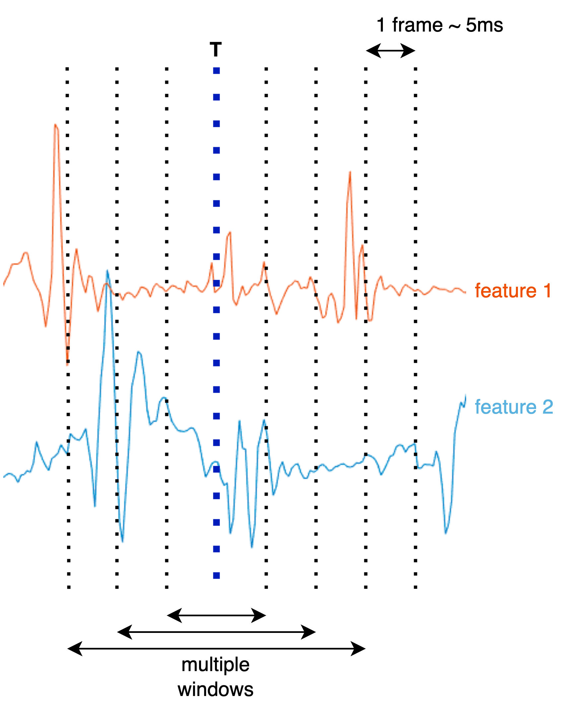

# bahnaric-phoneme

## Motivation
The `bahnaric-phoneme` project is driven by the objective to empower Bahnaric language speakers, fostering communication within their community and with other ethnic groups. Our overall goal is to contribute to the empowerment and connectivity of Bahnaric ethnic communities through targeted advancements in speech processing.

## Data
The data utilized in this project originates from a broader research initiative spearheaded by Prof. [Quan Thanh Tho](mailto:qttho@hcmut.edu.vn). Please ensure to obtain his consent prior to using the data for any other purposes.

## Features Engineering
1. This project leverages widely-used acoustic features, including MFCC, F0, and energy.
2. In order to address the challenge of varying speech signal lengths, we employ a sliding window approach to divide the speech signals into frames. Subsequently, we compute the average of each feature within each frame.

## Steps to Reproduce
1. Install the required packages by running `pip3 install -r requirements.txt`.
2. Generate the features by running `python3 src/dataset.py`.
3. Train the model by running `python3 src/train.py`.
4. Evaluate the model by running `python3 src/evaluate.py`.

### For Windows Users
1. Install docker desktop for windows. [guide](https://docs.docker.com/desktop/install/windows-install/)
2. Choose `Rebuild and Reopen in Container` in the popup window.
